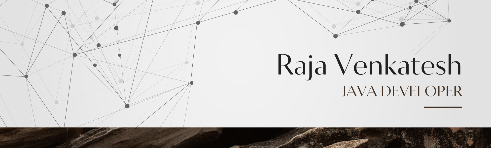

# Hi there! 👋 I'm Raja Venkatesh

**Computer Science Engineering Student | Full-Stack Developer**

Final year B.Tech CSE student at SRM Institute of Science and Technology with a passion for building scalable web applications. Currently serving as Public Relations Head at SRM IEEE Student Branch, leading technical workshops and community engagement.

## 🛠️ Tech Stack

**Languages**

**Frontend**

**Backend & Cloud**

**Tools & Others**

## 🤝 Let's Connect!

**⚡ Building the future, one commit at a time**

